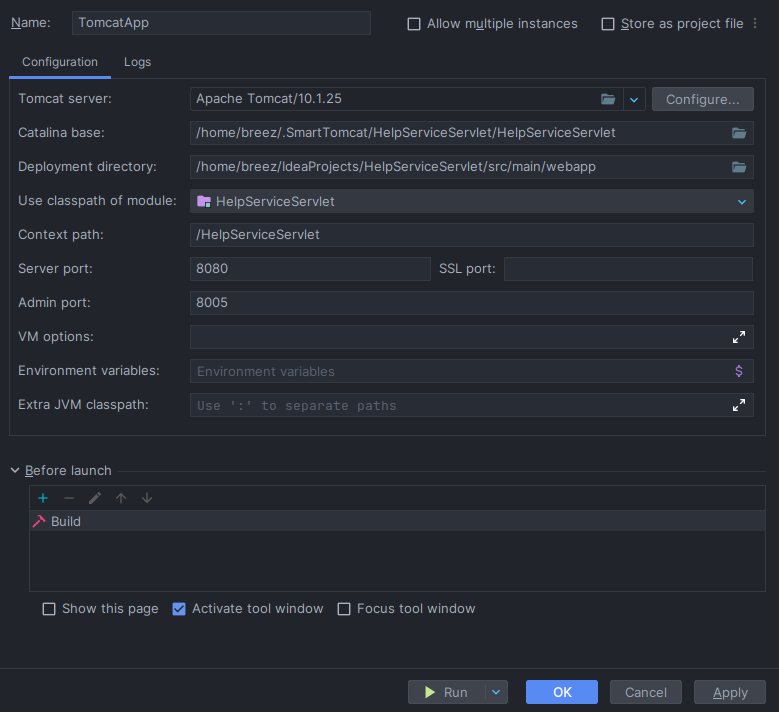
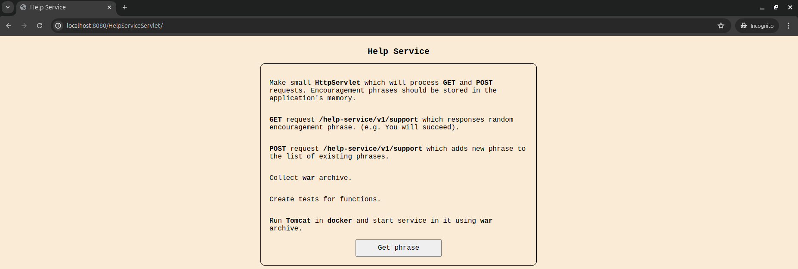
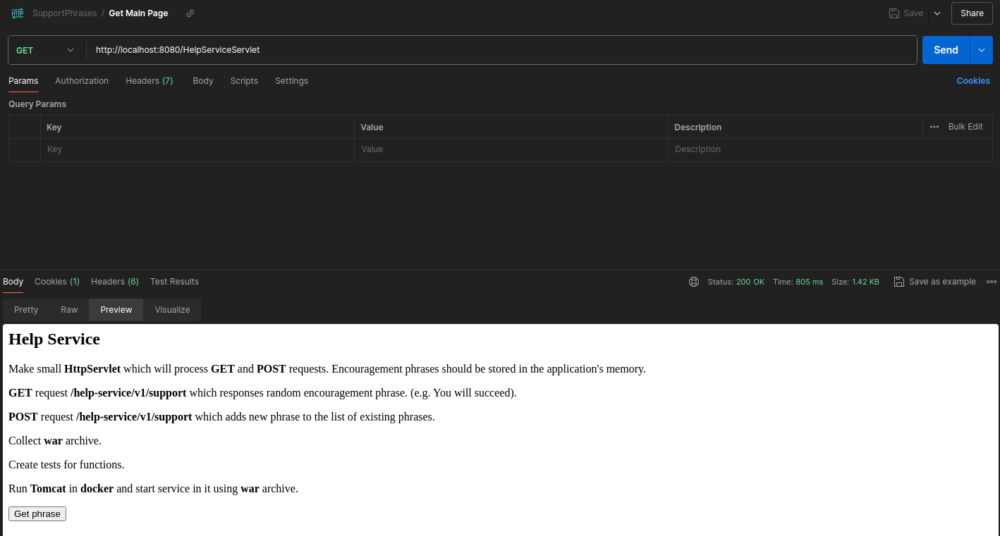
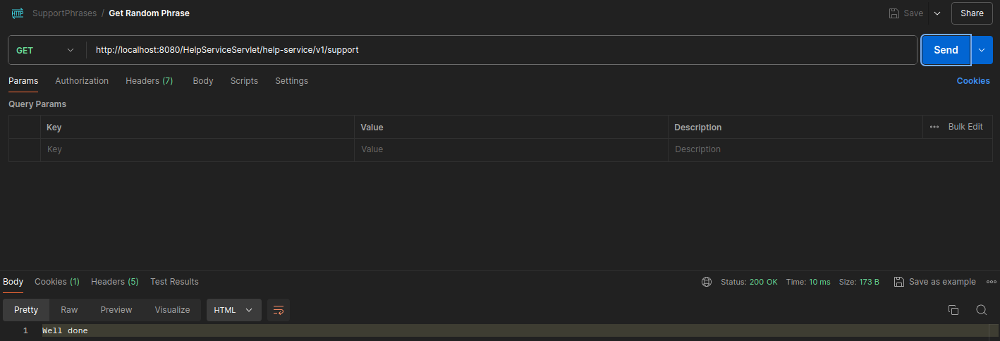
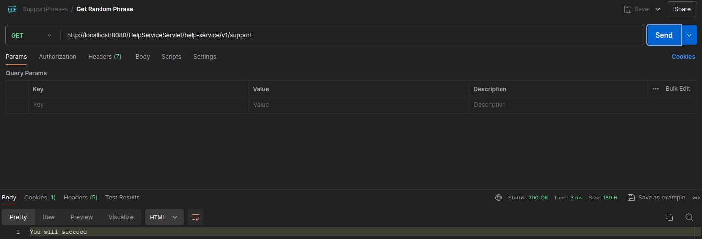
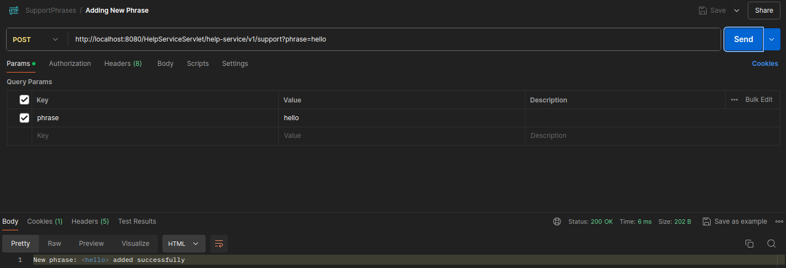
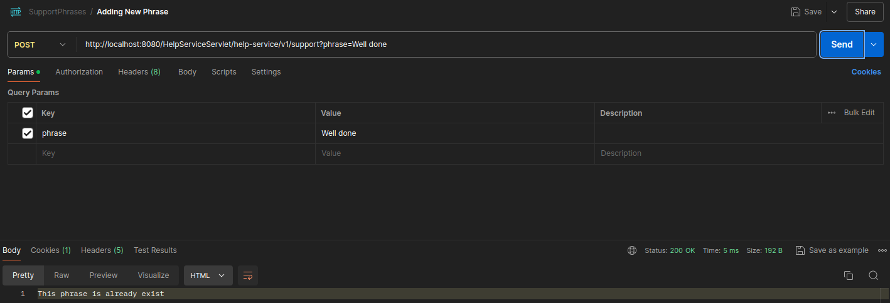

# Small Help Service

## Content

- [Part 1. Making HttpServlet](#part-1-making-httpservlet)
- [Part 2. Creating GET request](#part-2-creating-get-request)
- [Part 3. Creating POST request](#part-3-creating-post-request)
- [Part 4. Creating war archive](#part-4-creating-war-archive)
- [Part 5. Run Tomcat with war archive using docker-compose](#part-5-run-tomcat-with-war-archive-using-docker-compose)


## Part 1. Making HttpServlet

### - Task
Make small `HttpServlet` which will process `GET` and `POST` requests. Encouragement phrases should be stored in the application's memory.

### - Implementation
Firstly need to install `Tomcat` and configurate application.



Start with creating main page with full task written in it. Main `GET` request will return the `.jsp` page with a content on it.

Redirections between pages written using `WebServlet` annotatiion.





Encouragement phrases are located in application's `memRepository`. It includes such functions as `getPhrase()` that return random phrase from `Map` and `addPhrase()` that add new phrase to the memory.


## Part 2. Creating GET request

### - Task
`GET` request `/help-service/v1/support` which responses random encouragement phrase. (e.g. You will succeed).

### - Implementation

`GET` request write a random phrase on the page.






## Part 3. Creating POST request

### - Task
`POST` request `/help-service/v1/support` which adds new phrase to the list of existing phrases.

### - Implementation

`POST` request add new phrase to the application's memory. If phrase is already exist in memory the corresponding line will be shown.





## Part 4. Creating war archive

### - Task 
Collect `war` archive.

### - Implementation

To collect `war` archive property `<packaging>` should be added to `pom.xml`. Also need to configure output in `<build>` section.

```
<build>
	<finalName>HelpServiceServlet</finalName>
	<plugins>
		<plugin>
			<groupId>org.apache.maven.plugins</groupId>
			<artifactId>maven-war-plugin</artifactId>
			<version>3.3.2</version>
		</plugin>
	</plugins>
</build>
```

Collect `war` archive with `maven` using command: `mvn package`.


For testing application `war` archive can be added into webapps folder into tomcat. After that `Tomcat` should be started and the application will pe placed on `localhost:8080/HelpServiceServlet`.

## Part 5. Run Tomcat with war archive using docker-compose

### - Task
Run `Tomcat` in `docker` and start service in it using `war` archive.

### - Implementation

Write a `docker-compose.yml` file with such services as `Tomcat` with image `tomcat:latest`, run an application on `8080` port from local machine into `8080` port in container and copy `war` archive inside container.

```
version: '3.8'

services:
  tomcat:
    image: tomcat:latest
    ports:
      - "8080:8080"
    volumes:
      - ./target/HelpServiceServlet.war:/usr/local/tomcat/webapps/HelpServiceServlet.war
    restart: on-failure
```
